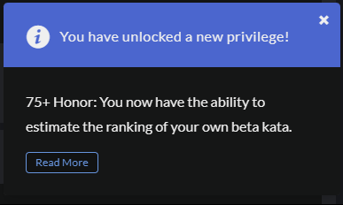

# История получения нового уровня -> kyu

---

### Date: 29.11.2024

1. Multiples of 3 or 5 (6 kyu)

2. Sum of Digits / Digital Root (6 kyu)

3. Unique In Order (6 kyu)

4. Your order, please (6 kyu)
5. Sum of odd numbers (7 kyu)
6. Array.diff (6 kyu)

7. Friend or Foe? (7 kyu)
8. The Hashtag Generator (5 kyu)

9. Split Strings (6 kyu)
10. Create Phone Number (6 kyu)
11. Decode the Morse code (6 kyu)
12. Valid Braces (6 kyu)

13. Josephus Permutation (5 kyu)
14. Maximum Multiple (7 kyu)
15. Memoized Fibonacci (5 kyu)
16. Number of trailing zeros of N (5 kyu)

17. Counting sheep (7 kyu)
18. Playing with digits (6 kyu)
19. 
20. 
21. 
22. 
23. 
24. 
25. 
26. 
27. 
28. 
29. 
30. 

### Date: --.--.2024

### Date: --.--.2024

