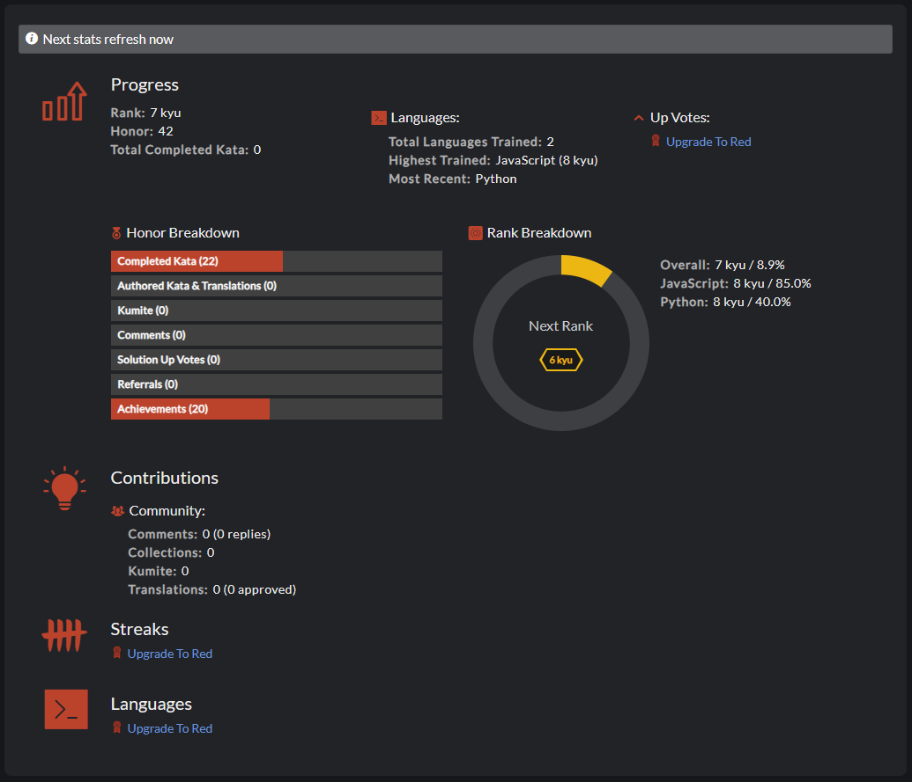

# История получения нового уровня -> kyu

---

### Date: 29.11.2024

1. Multiples of 3 or 5 (6 kyu)

2. Sum of Digits / Digital Root (6 kyu)

3. Unique In Order (6 kyu)

4. Your order, please (6 kyu)
5. Sum of odd numbers (7 kyu)
6. 6
7. 7
8. 8
9. 9
10. 10
11. 11
12. 12
13. 13
14. 14
15. 15
16. 16
17. 17
18. 18
19. 19
20. 20
21. 21
22. 22
23. 23
24. 24
25. 25
26. 26
27. 27
28. 28
29. 29
30. 30

### Date: --.--.2024

### Date: --.--.2024

